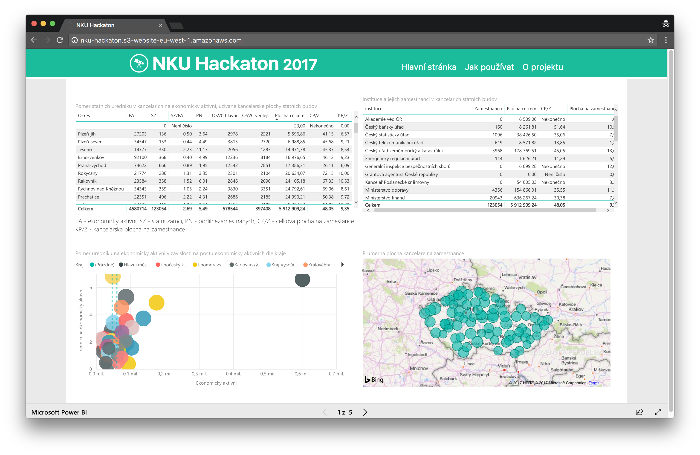

NKU Hackaton project
=============

Název aplikace:
-------------

- NKU Hackaton 2017 aka "CRABAPP"

Stručný slovní popis:
-------------

- Základem je vizualizace dat z Centrálního registru administrativních budov (posktytovatel MF ČR). A dále k těmto datům relevantně přidat další datasety, které půjdou připojit (v závislosti na kvalitě).

Printscreen navrhovaného řešení:
-------------

Seznam použitých opendatových sad:
------------- 

- Centrální registr administrativních budov (MF ČR) [2015]
- Přehled o celkovém počtu OSVČ (ČSSZ) [2010-2017]
- Registr územní identifikace, adres a nemovitostí (ČÚZK) [2015]
- Uchazeči o zaměstnání dosažitelní a podíl nezaměstnaných osob podle obcí (ČZSO) [2015-2017]
- Základní výsledky Sčítání lidu, domů a bytů (ČSÚ) [2011]
- Územní teploty (ČHMÚ) [2015-2017]

Seznam členů týmu:
-------------

- Dalibor Jaroš
- Michal Haták
- Martin Hlaváč
- Vojta Nitra

Číslo týmu:
-------------

- 9 

Odkaz:
-------------

- http://nku-hackaton.s3-website-eu-west-1.amazonaws.com
