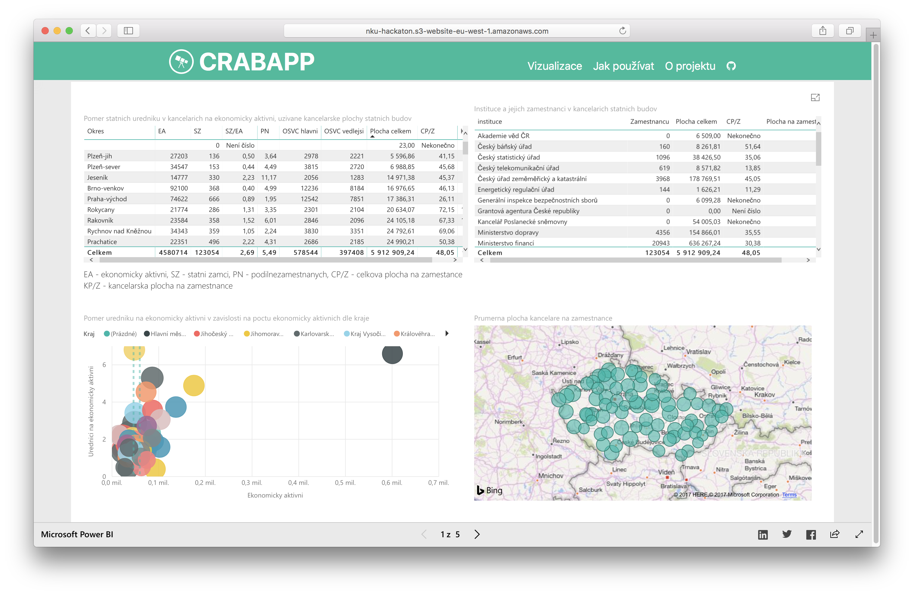
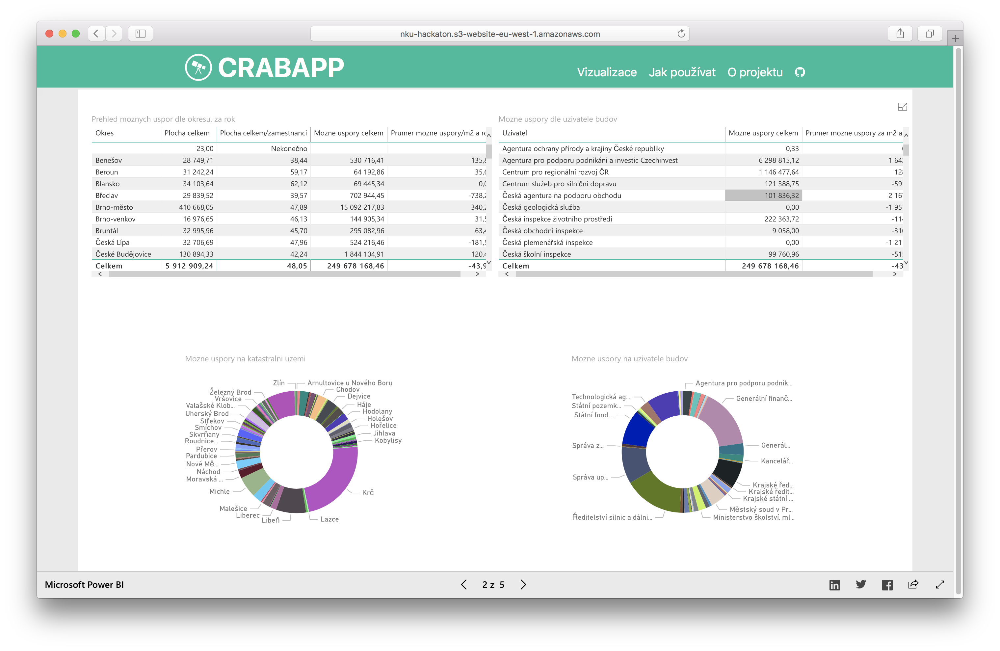
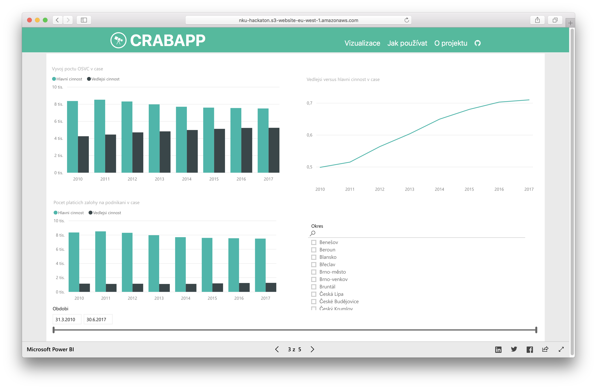
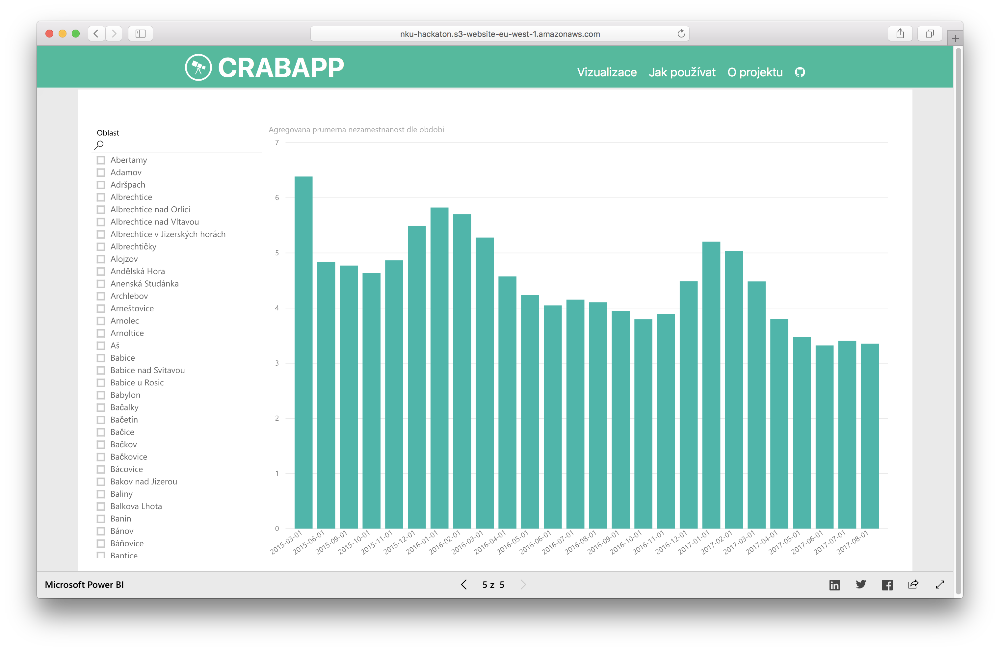

NKU Hackaton project
=============

Název aplikace:
-------------

- NKU Hackaton 2017 aka "CRABAPP"

Stručný slovní popis:
-------------

- Základem je vizualizace dat z Centrálního registru administrativních budov (posktytovatel MF ČR). A dále k těmto datům relevantně přidat další datasety, které půjdou připojit (v závislosti na kvalitě).

Printscreen navrhovaného řešení:
-------------

Seznam použitých opendatových sad:
------------- 

- [Centrální registr administrativních budov (MF ČR)](http://data.mfcr.cz/cs/dataset/centralni-registr-administrativnich-budov) [2015]
- [Přehled o celkovém počtu OSVČ (ČSSZ)](https://data.cssz.cz/documentation/prehled-o-celkovem-poctu-osvc-podle-okresu) [2010-2017]
- [Registr územní identifikace, adres a nemovitostí (ČÚZK)](http://vdp.cuzk.cz) [2015]
- [Uchazeči o zaměstnání dosažitelní a podíl nezaměstnaných osob podle obcí (ČZSO)](https://www.czso.cz/csu/czso/uchazeci-o-zamestnani-dosazitelni-a-podil-nezamestnanych-osob-podle-obci_090417) [2015-2017]
- [Základní výsledky Sčítání lidu, domů a bytů (ČSÚ)](https://nkod.opendata.cz/datová-sada?iri=https%3A%2F%2Fnkod.opendata.cz%2Fzdroj%2Fdatová-sada%2F240789) [2011]
- [Územní teploty (ČHMÚ)](http://portal.chmi.cz/historicka-data/pocasi/uzemni-teploty) [2015-2017]

Seznam členů týmu:
-------------

- [Dalibor Jaroš](https://www.linkedin.com/in/dalibor-jaroš-597b7189/)
- [Michal Haták](https://www.linkedin.com/in/twista/)
- [Martin Hlaváč](https://www.linkedin.com/in/hlavacm/)
- [Vojta Nitra](https://www.linkedin.com/in/vojtěch-nitra-15814b58/)

Číslo týmu:
-------------

- 9 

Odkaz:
-------------

- http://nku-hackaton.s3-website-eu-west-1.amazonaws.com
